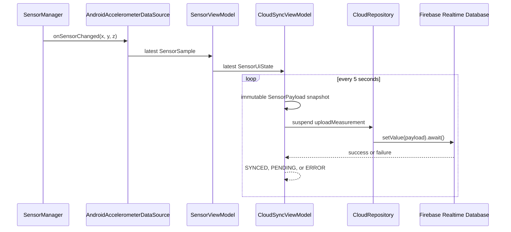

# Sleep Tracker Simulator

Android educational project combining independent phone and virtual-wearable sensor streams. It is not a medical application or sleep-stage detector.

## Lab 1 — phone movement

`AndroidAccelerometerDataSource` observes the phone accelerometer. `MovementClassifier` smooths changes between acceleration vectors and exposes `STILL` or `MOVEMENT` through `SensorViewModel` and `StateFlow`. This pipeline remains live with BLE disconnected, scanning, connecting, connected, and after disconnect.

## Lab 2 — Virtual Sleep Band

`VirtualSleepBand` models an external BLE heart-rate wearable. The transport remains software-based, while its lifecycle and profile mirror a concrete BLE sensor:

- scan and discover `Sleep Band HR [VIRTUAL:HR:01]`;
- connect and discover Heart Rate Service `0x180D`;
- subscribe to Heart Rate Measurement `0x2A37`;
- receive smooth, bounded heart-rate measurements through simulated Notify;
- Read Body Sensor Location `0x2A38`;
- Write `START_STREAM`, `STOP_STREAM`, or `REQUEST_STATUS`;
- reject unknown commands.

The generator uses a bounded random walk from a configurable initial BPM. Its interval and variation source are injectable. The most recent 60 measurements feed the live Compose Canvas graph.

## Combined Rest-State Estimation

`RestStateClassifier` combines phone movement, movement intensity, continuous still duration, current wearable HR, and a recent HR window. It produces:

- `MONITORING` — wearable or sensor data is unavailable, or an HR baseline is still being collected;
- `ACTIVE` — the accelerometer detects movement;
- `RESTING` — movement is low for a sustained period without enough evidence for possible sleep;
- `POSSIBLE_SLEEP` — prolonged uninterrupted stillness and stable recent HR occur together.

HR stability uses both population standard deviation and range. No absolute BPM threshold determines sleep. Classroom defaults intentionally shorten the temporal thresholds: `RESTING` after 3 seconds and `POSSIBLE_SLEEP` after 12 seconds, with at least 5 HR samples. These demonstrate transitions during a short lab session; they are not physiological thresholds.

This is an educational heuristic and not a medical sleep-stage classifier.

```text
Android Accelerometer
        |
        v
MovementClassifier
        |
        +-------------------+
                            |
                            v
                    RestStateClassifier
                            ^
                            |
Virtual Sleep Band          |
        |                   |
        v                   |
Mock BLE Connector          |
        |                   |
        v                   |
Heart Rate Measurement -----+
                            |
                            v
                       RestState
                            |
                            v
                       Compose UI
```

`SensorViewModel` and `BleViewModel` remain independent. `RestStateViewModel` combines their immutable `StateFlow` outputs without making either source ViewModel depend on the other.

## Lab 3 — Firebase Realtime Database

`CloudSyncViewModel` samples the latest sensor, BLE, and derived rest state every five seconds. It owns one idempotent periodic job: `startSync()` cannot create duplicates, `stopSync()` cancels sampling, and `endMonitoring()` flushes pending records when online before writing `endedAt`. It creates immutable `SensorPayload` values and delegates persistence to `CloudRepository`; Compose contains no Firebase calls. `FirebaseCloudRepository` writes to the configured European Realtime Database instance through the main `firebase-database` module and coroutine `Task.await()`.

`value` is the smoothed movement intensity in m/s². It is duplicated as `movementIntensity` so the generic laboratory field and the domain-specific meaning are both explicit. The logical `deviceId` is `sleep-tracker-simulator`; no hardware or personal identifier is collected.



Database shape:

```text
sessions/{sessionId}
├── deviceId
├── startedAt
├── endedAt
└── measurements/{pushId}
    ├── deviceId, sensorType, timestamp
    ├── x, y, z, value
    ├── movementState, movementIntensity
    └── heartRateBpm, bleConnected, restState
```

When Android reports no validated internet, payloads enter a bounded 50-item in-memory FIFO queue and UI status becomes `PENDING`. At the next five-second tick after connectivity returns, queued values are uploaded oldest first before the current sample. The queue intentionally does not survive process death; persistent storage belongs to a later lab.

`Disconnect Sleep Band` affects only the virtual BLE wearable. Accelerometer monitoring and cloud synchronization continue. `End Monitoring` is separate: it stops periodic cloud sampling and, when online, closes the Firebase session with `endedAt`. Ending offline stops locally and leaves the session open with a visible `PENDING` diagnostic because an in-memory queue cannot guarantee delivery after process death. `Start Monitoring` can resume synchronization without creating duplicate jobs.

Cloud orchestration tests use coroutine virtual time and fake repository/network implementations. They cover the first five-second tick, duplicate-start prevention, disconnected and connected payloads, state transitions, failures, FIFO recovery, queue bounds, cancellation, restart, and session end without contacting Firebase.

Logcat tag `CloudSync` reports successful, pending, and failed uploads without logging payload values or Firebase configuration.

## Lab 4 — Actuator Control

`DecisionEngine` receives the existing smoothed movement intensity from `SensorViewModel`. It is a pure Kotlin edge detector with an educational threshold of `0.65 m/s²`: a transition from below to `>=` the threshold while movement is classified as `MOVEMENT` produces one vibration pulse. Remaining above the threshold produces no repeated alerts; dropping below rearms it. Automatic movement alerts can be disabled without disabling manual or remote control.

```text
SensorManager → MovementClassifier → SensorViewModel → DecisionEngine
                                                        |
                                              threshold crossed?
                                                /             \
                                              no              yes
                                              none      vibration pulse
```

`AndroidSmartActuator` uses `VibratorManager` and `VibrationEffect` for pulse or persistent vibration. Flashlight control uses `CameraManager.setTorchMode()` only after checking `FEATURE_CAMERA_FLASH`, selecting a flash-capable camera, and checking camera permission. Missing hardware and API failures are represented as `UNAVAILABLE` or `ERROR`; the UI never claims that unavailable hardware is active. Automatic control uses vibration only. Flashlight is reserved for Manual Control and Firebase commands.

Cloud-to-device commands use a separate event-driven path from Lab 3 telemetry:

```text
Firebase RTDB control/sleep-tracker-simulator
        ↓ ValueEventListener (not polling)
FirebaseRemoteControlRepository
        ↓ callbackFlow
ActuatorViewModel
        ↓
SmartActuator → VibratorManager / CameraManager
```

The typed remote node is:

```json
{
  "control": {
    "sleep-tracker-simulator": {
      "vibrationEnabled": false,
      "flashlightEnabled": false
    }
  }
}
```

`awaitClose` removes the Firebase listener when collection is cancelled. `ActuatorViewModel.onCleared()` cancels its collectors and calls `stopAll()` so repeating vibration and torch do not remain active. `Disconnect Sleep Band` still affects only BLE; `End Monitoring` still affects only Lab 3 telemetry. Local, manual, and Firebase actuator controls remain independent of both.

Event-driven control reacts when Firebase invokes the listener after a server-side change. Polling would repeatedly ask the server whether a value changed; Lab 4 does not poll.

The actuator tests cover threshold edges and rearming, no-spam behavior, automatic enable/disable, manual and remote commands, unavailable hardware, remote errors, operation failures, and cleanup. Emulator flashlight availability depends on its virtual hardware profile; `Flashlight unavailable` is the correct result when the feature is absent.

## Verification

```powershell
.\gradlew.bat testDebugUnitTest
.\gradlew.bat assembleDebug
```

Educational simulation; not a medical sleep-stage detector.
